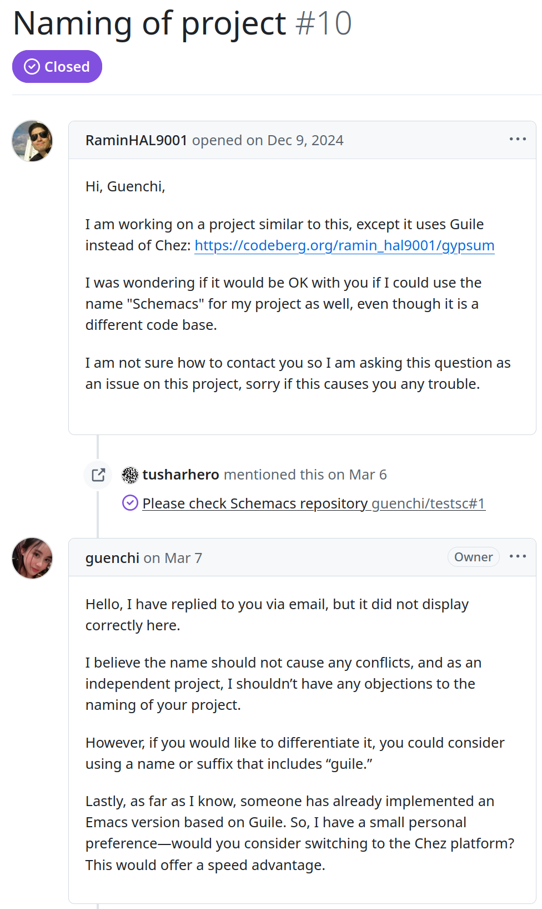

# Project Gypsum

#### A clone of Emacs and Emacs Lisp written in R7RS Scheme

This project was renamed to "[Schemacs](https://codeberg.org/ramin_hal9001/schemacs)." To prevent confusion, the state of the source code before the name change is archived here.

A separate project named "[Schemacs](https://github.com/guenchi/schemacs)" by user [Guenchi](https://github.com/guenchi) which is unrelated to this project, though has the same goals, had already been published on GitHub. This project was renamed to "Schemacs" [**with permission**](https://github.com/guenchi/Schemacs/issues/10) from Guenchi.

